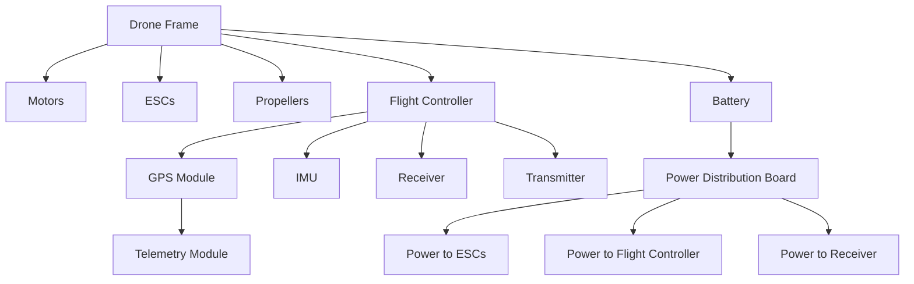

```mermaid
graph TD
    A[Drone Frame] --> B[Motors]
    A --> C[ESCs]
    A --> D[Propellers]
    A --> E[Flight Controller]
    A --> F[Battery]
    E --> G[GPS Module]
    E --> H[IMU ]
    E --> I[Receiver ]
    E --> J[Transmitter ]
    G --> K[Telemetry Module]
    F --> L[Power Distribution Board ]
    L --> M[Power to ESCs]
    L --> N[Power to Flight Controller]
    L --> O[Power to Receiver]
```
